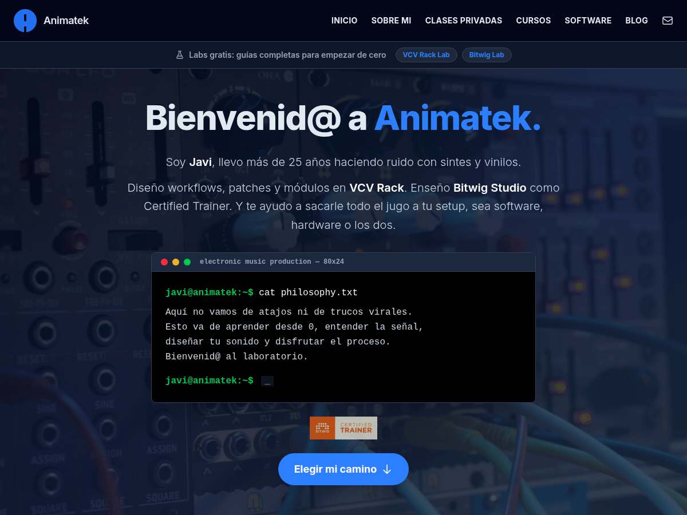

# Animatek WordPress Theme



Este es el tema oficial de WordPress para **[Animatek.net](https://animatek.net)**, diseñado para ofrecer una experiencia de usuario premium, minimalista y de alto rendimiento. Construido sobre la base de **TailPress** y potenciado por **Tailwind CSS v4** y **Vite**.

## 🚀 Características Principales

- **Diseño Ultra-Moderno**: Estética minimalista enfocada en la legibilidad y la experiencia del usuario (UX).
- **Tailwind CSS v4**: Aprovechando las últimas capacidades del motor JIT y variables CSS nativas.
- **Vite Integration**: Compilación ultra rápida de assets para un flujo de desarrollo ágil.
- **Tutor LMS Ready**: Integración profunda con el sistema de cursos y academia de Animatek.
- **Librería Sonora**: Plantillas personalizadas para la gestión y visualización de recursos de audio y VCV Rack.
- **Dynamic Blogs**: Sistema de posts rediseñado con navegación fluida y componentes editoriales avanzados.

## 🛠 Tecnologías

- **Núcleo**: HTML5, PHP 8.1+, JavaScript (ES6+).
- **Estilos**: Tailwind CSS v4 (Vanilla CSS workflow).
- **Build System**: Vite.
- **Framework WP**: TailPress Framework.
- **Dependency Management**: Composer & NPM.

## 📦 Instalación y Desarrollo

1.  **Clonar el repositorio**:
    ```bash
    git clone https://github.com/animatek/animatek-theme.git animatek-tailpress
    ```
2.  **Instalar dependencias**:
    ```bash
    composer install
    npm install
    ```
3.  **Desarrollo**:
    ```bash
    npm run dev
    ```
4.  **Producción**:
    ```bash
    npm run build
    ```

## 📝 Changelog (Registro de Cambios)

### v5.2.0 (Mayo 2026) - Auditoría, refactor y rendimiento
- **Seguridad**:
  - Handler AJAX `animatek_like` con `check_ajax_referer` y validación (cierra el nonce huérfano de la librería sonora).
  - `searchform.php` escapa `get_search_query()` con `esc_attr()`.
  - JSON-LD del curso sin `JSON_UNESCAPED_SLASHES` (previene inyección de `</script>`).
  - `error_log`, `*.log` y `skills-lock.json` fuera del repo y del paquete de release; `.distignore` ampliado.
- **Rendimiento**:
  - Self-host de Inter via `@fontsource-variable/inter`. Eliminados `preconnect` a Google Fonts y enqueue remoto. Solo se descargan los subsets que la página usa (~48 KB latín).
- **Diseño**:
  - Paleta primaria unificada a `#2C7FFF` en `theme.json`, `theme.css`, `app.css`, `custom.css` y todas las plantillas (excepto `page-test-colores.php`, que documenta el azul antiguo).
- **Refactor**:
  - `page-glosario.php`: 1223 → 542 líneas. Datos a `inc/glosario-data.php`, modal a `template-parts/glosario-modal.php`, helper sin `global`.
  - `page-vcvrack-lab.php` y `page-bitwig-lab.php`: locker Brevo extraído a `template-parts/brevo-locker.php` parametrizable (-217 y -155 líneas respectivamente).
  - Eliminado fallback inline del menú móvil en `functions.php` (sobrescribía a `app.js`).
- **Tailwind**:
  - Eliminada la capa v3 vestigial: borrados `tailwind.config.js` y `safelist.txt`, removidas las directivas `@tailwind base/components/utilities` redundantes en `app.css`. `--color-accent` añadido al `@theme`.
- **Fix**:
  - URL de `Nomad2026.webp` actualizada tras re-subida en `2026/05/`.

### v5.1.0 (Abril 2026) - Rediseño Editorial
- **Hero Editorial B1**: Nueva estructura de cabecera para posts con imagen a la izquierda y metadatos a la derecha.
- **Navegación entre Posts**: Implementación de navegación fluida sin sombras, alineada con la columna de contenido.
- **Pill Chips**: Estilización de etiquetas y categorías con formato "pill" y micro-interacciones.
- **Blog Redesign**: Actualización completa de la ficha de post para mejorar la jerarquía visual y el espaciado.
- **Fixes**: Ajustes de padding y gaps en las columnas de metadatos del Hero.

### v5.0.0 (Octubre 2025)
- Migración completa a **Tailwind CSS v4**.
- Implementación de **Vite** como compilador por defecto.
- Soporte para autoloading de Composer.
- Integración del paquete `tailpress/framework`.

---

© 2026 Javier Melgar (Animatek). Todos los derechos reservados.
